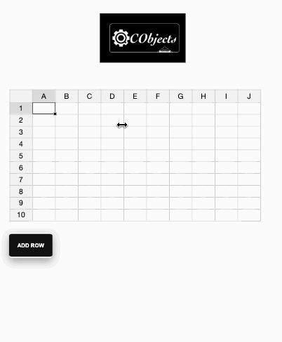

# QCObjects-JExcel-Demo
A Demo using JExcel (https://bossanova.uk/jexcel/v3/) and QCObjects (https://qcobjects.dev) together

# Step 1: Installing qcobjects

Open a shell and executes this command. (I guess you already know you need nodejs pre-installed in your computer in order to follow this step)

```shell
 npm install qcobjects-cli -g && npm install qcobjects --save
```

# Step 2: Insert the JExcel library.

Inside the ```<head>``` tag put the following:

```html
<script src="https://bossanova.uk/jexcel/v3/jexcel.js"></script>
<link rel="stylesheet" href="https://bossanova.uk/jexcel/v3/jexcel.css" type="text/css" />
<script src="https://bossanova.uk/jtools/v2/japp.js"></script>
<link rel="stylesheet" href="https://bossanova.uk/jtools/v2/japp.css" type="text/css" />

```

# Step 3: Write the HTML code in your component.

Inside a component template, you can write something like this:

```html
<div id="spreadsheet"></div>
<div>
<button>ADD ROW</button>
</div>

```

# Step 4: Write your spreadsheet custom controller.

In a file like ```org.mydomain.mycontrollerspackage.js``` you can write the following:

```javascript
Class('JExcelController',Controller,{
  component:null,
  spreadsheet:null,
  _new_:function (o){
    var controller=this;
    logger.debug('JExcelController Element Initialized');
  },
  jexcelConfig:function (){
    var options = options = {
      data:[[]],
      minDimensions:[10,10],
    };

    this.spreadsheet = jexcel(this.component.body.subelements('#spreadsheet')[0], options);
  },
  done: function (){
    var controller = this;
    this.component.body.subelements('button')[0].addEventListener('click',function (){
      controller.insertRow();
    },false);

    controller.jexcelConfig();
  },
  insertRow:function (){
    this.spreadsheet.insertRow();
  }
})
```

# Result:

I expect you got a result like this:



Save time and clone this repo or download it from here:

[This Repo](https://github.com/QuickCorp/QCObjects-JExcel-Demo.git)
